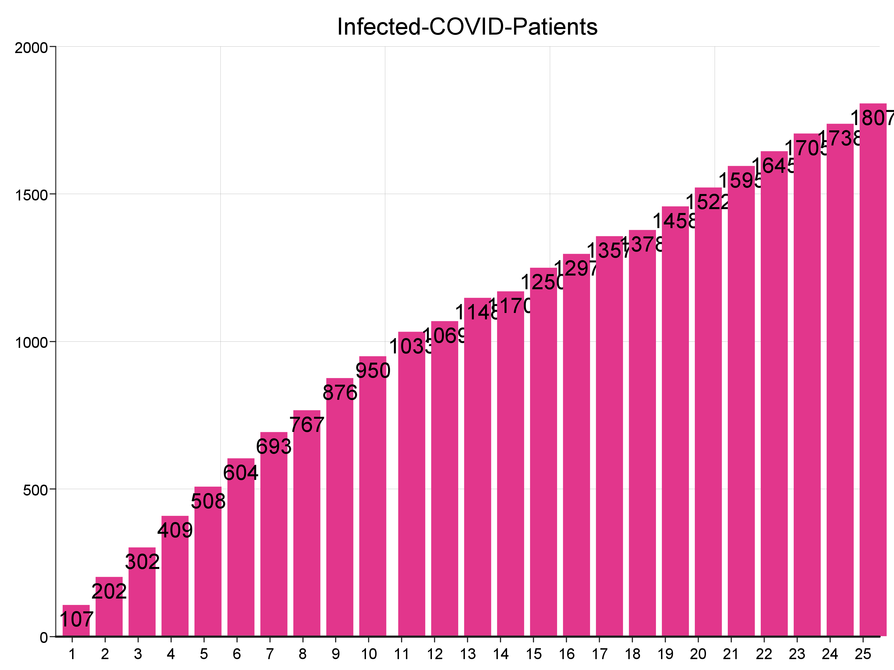
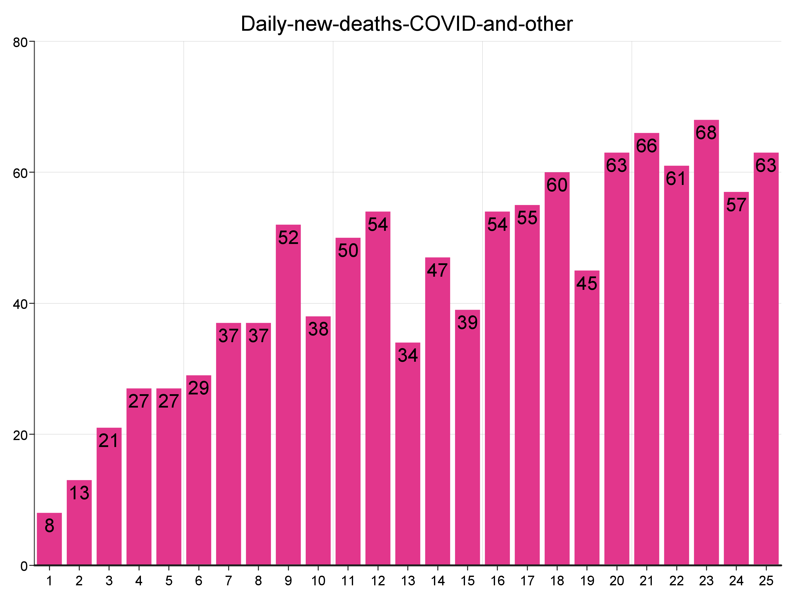
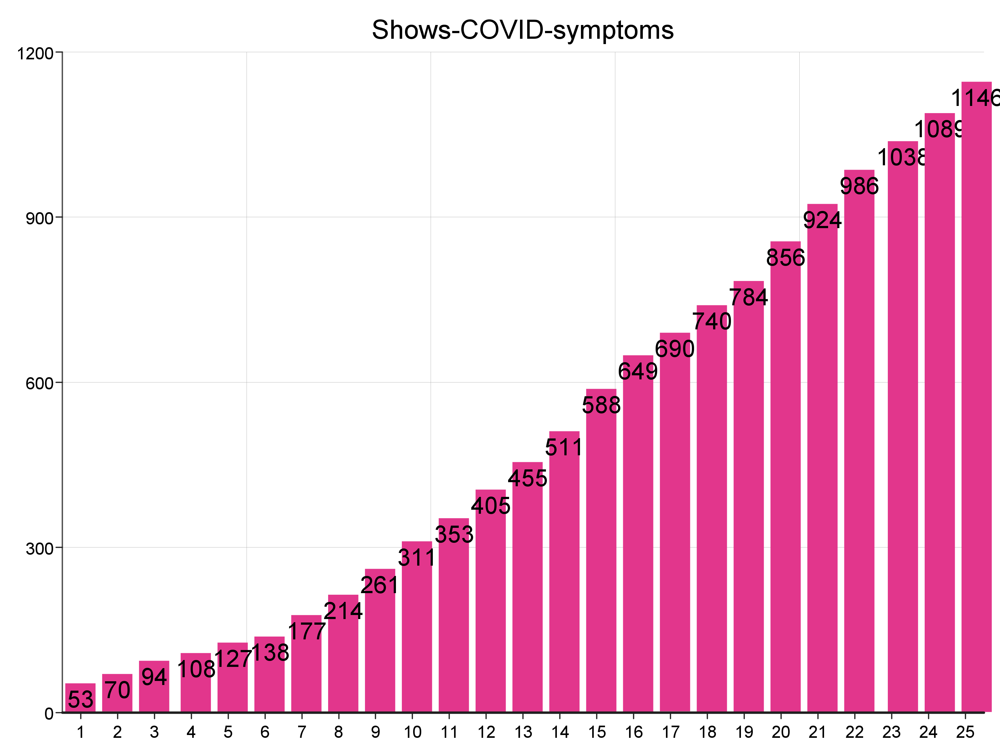
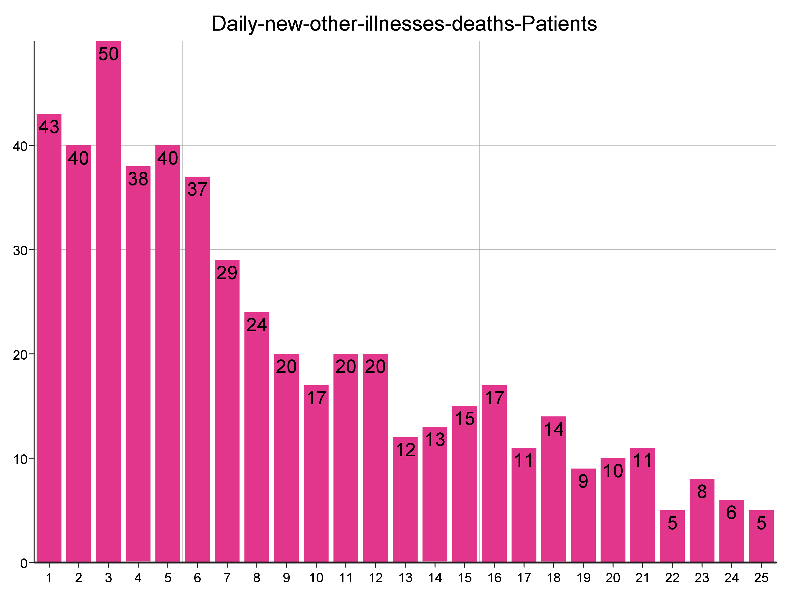

# COVID-19-Simulator
A project for Scala classes at AGH UST, Poland

## Reasons of writing this application

### About COVID
Coronavirus disease 2019 (COVID-19) is an infectious disease caused by severe acute respiratory syndrome coronavirus 2 (SARS-CoV-2). It was first identified in December 2019 in Wuhan, China, and has since spread globally, resulting in an ongoing pandemic. As of 27 May 2020, more than 5.61 million cases have been reported across 188 countries and territories, resulting in more than 350,000 deaths. More than 2.3 million people have recovered.

###Why use simulation modeling?
Simulation modeling solves real-world problems safely and efficiently. It provides an important method of analysis which is easily verified, communicated, and understood. Across industries and disciplines, simulation modeling provides valuable solutions by giving clear insights into complex systems.

## Setup
In src/main/resources/parameters.txt file there are several parameters to setup before starting simulation:
1. Size of hospital:
    - numberOfFloors (in Hospital)
    - numberOfRoomsOnFloor
    - patientRoomCapacity (maximum number of patient in each patient room)

2. Number of patients and staff at the begining of the simulation
    - startingPatientsCount (number of patients at the begining of simulation)
    - startingDoctorsCount (number of doctors at the begining of simulation)
    - startingNursesCount (number of nurses at the begining of simulation)

3. Length of simulation
    - durationInDays 

4. End hour of working hospital each day
    - endHourDay

5. Strategy of simulation:
    - newPatientsEachDay (number of patients which will come to hospital at the begining of each day)
    - dayToShowCovidSymptoms (day on which COVID-19 symptoms will reveal)
    - dayOnWhichRecovered (day on which patient will recover)
    - probabilityOfDeath (each day there is drawn randomly whether patient is dead or not)
    - probabilityOfInfection (each 30 minutes of simulation there is drawn randomly whether patient has been infected or not)

## Sample results of simulation 

### Sample setup
- numberOfFloors=50
- numberOfRoomsOnFloor=30
- patientRoomCapacity=6
- startingPatientsCount=800
- startingDoctorsCount=70
- startingNursesCount=150
- durationInDays=25
- endHourDay=18
- newPatientsEachDay=300
- dayToShowCovidSymptoms=5
- dayOnWhichRecovered=10
- probabilityOfDeath=5
- probabilityOfInfection=1

### Plots

